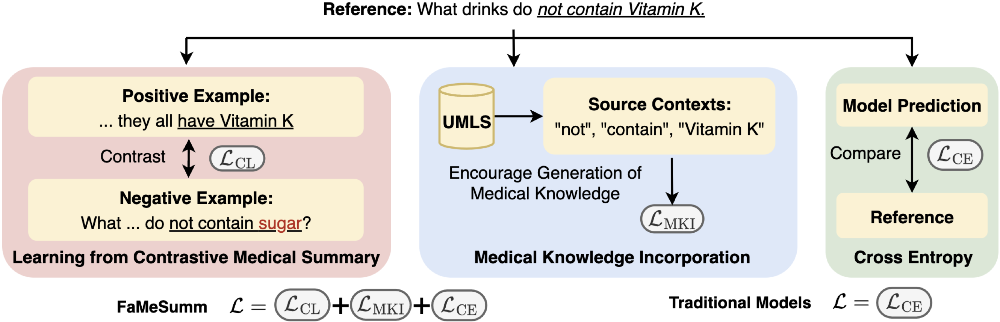

# FaMeSumm
Code for EMNLP 2023 paper "FaMeSumm: Investigating and Improving Faithfulness of Medical Summarization"

Navigation:
[Overview](#overview), 
[Datasets](#datasets),
[Contrastive Sets Construction](#contrastive-sets-construction),
[Models and Experiments](#models-and-experiments),
[Repository Structure](#repository-structure)

## Overview
We introduce **FaMeSumm**, a framework to improve **Fa**thfulness for **Me**dical **Summ**arization. FaMeSumm is a general-purpose framework applicable to various language models on many medical summarization tasks. It adopts two objectives that finetune pre-trained language models to explicitly model faithfulness and medical knowledge. The first one uses contrastive learning that adopts **much simpler heuristics (as straightforward as rule-based copying and manipulating source texts)** than other contrastive learning baselines. The second objective learns medical knowledge by **modeling medical terms and their contexts** in the loss function. FaMeSumm delivers **consistent improvements over mainstream language models** such as BART, T5, mT5, and PEGASUS, yielding state-of-the-art performances on metrics for faithfulness and general quality. Human evaluation by doctors also shows that **FaMeSumm generates more faithful outputs**. The figure below shows a diagram of FaMeSumm architecture with an example reference summary. The underlined part in the reference contains a medical term (“Vitamin K”) and its context (“do not contain”) that are modeled by FaMeSumm.

## Datasets
We have tested FaMeSumm on different kinds of datassets to demonstrate its capability on various medical summarization tasks: Health Question Summarization (HQS),  Radiology Report Summarization (RRS), and Medical Dialogue Summarization (MDS). We are not allowed to share these datasets due to legal concerns, so we recommed to collect them by yourself. You may need to complete user agreement or crawl data on your own.
1. HQS: The first task of [MEDIQA 2021](https://sites.google.com/view/mediqa2021). The goal of this task is to summarize potentially complex consumer health questions.
2. RRS: The third task of [MEDIQA 2021](https://sites.google.com/view/mediqa2021). This task comes with two test splits (benchmarks): Indiana and Stanford. The goal of this task is to summarize the textual findings of radiology report written by radiologists.
3. MDS: A private Chinese dataset for medical dialogue summarization. We train models on this dataset to test their capabilities on understanding and summarizing doctor-patient conversations. To reproduce a dataset similar to our MDS, please refer to Appendix B of our paper to see the detailed data collection process.

Once the raw datasets are collected, check `sample_datasets` folder to see how we format data instance of each dataset. You need to match the formats in order to run experiments. Specifically, `question` represents a patient question that needs to be summarized, `summary` represents a reference summary, `1_medical` represents medical terms that appears in a reference summary only, `2_medical` represents medical terms that appears in both reference summary and source text/conversation/question, `neg_uni` represents the negative unigrams that exist in the reference, `content` contains a few `utterance` by different `speaker` of a medical dialogue, and `text` represents the source text of RRS dataset. In RRS, we concatenate the findings and background of the original dataset to form `text`. In MDS, `description` is usually the first utterance from the patient of a specific dialogue, and `type-B` is the reference summary.

## Contrastive Sets Construction

## Models and Experiments
